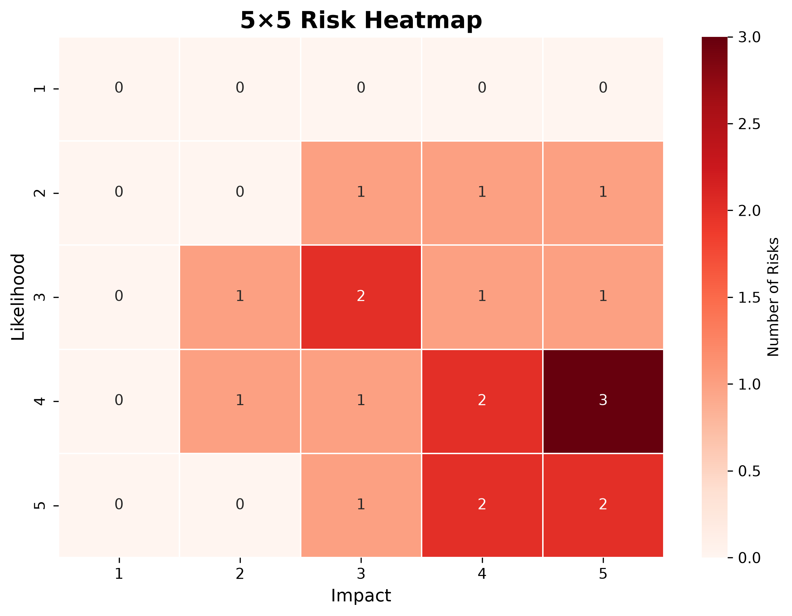

# GRC Risk Heatmap Generator

## 📌 What is this?
A simple yet professional Python tool to generate a 5×5 risk heatmap from a CSV file containing risk likelihood and impact scores. The heatmap visually highlights which risk combinations are most frequent (or severe), aiding in prioritisation.

## 🎯 Why was it made?
To provide GRC professionals and security analysts with an instant visual summary of their risk landscape, making it easier to communicate findings to non‑technical stakeholders.

## 🔥 What GRC problem does it solve?
Traditional risk registers are tables of numbers; this tool turns them into an intuitive colour‑coded matrix. It reveals clusters of high‑impact/high‑likelihood risks at a glance, supporting better decision‑making.

## 🚀 How to run it
1. **Clone this repository**  
   `git clone https://github.com/DanielMogilevskiy/grc-risk-heatmap.git`
2. **Install dependencies**  
   `pip install -r requirements.txt`
3. **Prepare your data** – place a CSV file (with columns `likelihood` and `impact`, each 1–5) in the `data/` folder, or specify a custom path.
4. **Run the script**  
   `python src/generate_heatmap.py`  
   (You can also pass your own CSV path: `python src/generate_heatmap.py path/to/your.csv`)
5. **Find the output** – the heatmap image is saved in `outputs/risk_heatmap.png`.

## 📷 Screenshot

## 🛠 Customisation
- Change the colour palette by modifying the `cmap` parameter (e.g., `'Blues'`, `'Greens'`).
- The script counts occurrences; you can modify it to average scores or use weighted values.

## 📄 License
MIT – free to use and modify.

## 👤 Author
Daniel Mogilevskiy – [GitHub](https://github.com/DanielMogilevskiy)